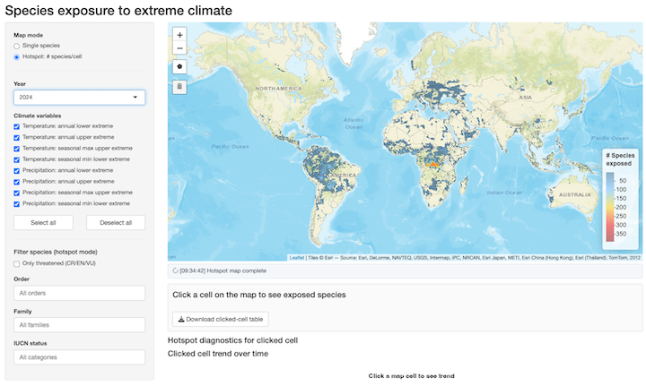

```{=html}
<style>
/* Prevent card focus state from resizing the map card */
.card:focus-within,
.bslib-card:focus-within {
  outline: none !important;
  box-shadow: none !important;
}
/* Prevent any flex child from growing beyond its allocated height.
   This stops the species table card from pushing the map row up.
   Every element in the flex chain must have min-height: 0. */
.bslib-gap-spacing,
.bslib-gap-spacing > *,
.html-fill-container,
.html-fill-item,
.bslib-card,
.bslib-card .card-body {
  min-height: 0 !important;
  min-width: 0 !important;
}
/* Cards in the bottom row scroll internally rather than expand */
.bslib-card .card-body {
  overflow: auto !important;
  overflow-x: hidden !important;
}
/* Force the leaflet widget and its wrappers to fill the card completely */
.bslib-card .card-body .html-widget,
.bslib-card .card-body .html-widget-output,
.bslib-card .card-body .leaflet,
.bslib-card .card-body .leaflet-container:not(.leaflet-control-minimap),
.leaflet:not(.leaflet-control-minimap),
.html-widget.leaflet-container:not(.leaflet-control-minimap) {
  width: 100% !important;
  height: 100% !important;
  grid-column: 1 / -1 !important;
}
/* Prevent bslib fill chain from collapsing the minimap */
.leaflet-control-minimap {
  flex: 0 0 auto !important;
}

/* ---- Hotspot Explorer: break bslib fill chain so explicit row heights work */
#hotspot-explorer .bslib-sidebar-layout,
#hotspot-explorer .main,
#hotspot-explorer .main > .bslib-grid {
  flex: 0 0 auto !important;
  height: auto !important;
}
.bslib-grid[data-height="525px"] {
  grid-template-rows: 525px 240px auto !important;
  height: auto !important;
}
</style>
```

```{r setup, include=FALSE}
# =============================================================================
# Setup chunk – loaded once at render time.
#
# Reads the pre-computed cache files produced by _R/01_prepare-data.R.
# No heavy computation happens here; all summarisation was done at build time.
# =============================================================================

library(dplyr)
library(ggplot2)
library(plotly)
library(leaflet)
library(jsonlite)
library(leaflet.extras)
library(DT)
library(terra)
library(raster)   # addRasterImage expects a {raster} object

# Source plotting helpers
source("_R/timeseries-plotting.R")

# ---------------------------------------------------------------------------
# Load pre-computed cache files
# These are written by _R/01_prepare-data.R during the build step.
# ---------------------------------------------------------------------------

# Main exposure data: full table + year index + trend tables
dashboard_data <- readRDS("data/exposure-dashboard.rds")

exposure_df   <- dashboard_data$exposure_df
year_index    <- dashboard_data$year_index
cell_trend    <- dashboard_data$cell_trend
sp_trend      <- dashboard_data$sp_trend
years_avail   <- dashboard_data$years_avail
vars_avail    <- dashboard_data$vars_avail
species_avail <- dashboard_data$species_avail

# Species metadata (name, order, family, IUCN status)
species_metadata <- readRDS("data/species-metadata.rds")

# Per-species timeseries cache (keyed by species name)
ts_cache <- readRDS("data/species-timeseries-cache.rds")

# Land template raster (defines the spatial grid; cells match exposure_df$cell)
# Loaded from data/ where the build step should have copied it from the release
tpl <- terra::rast("data/landTemplate.tif")

# ---------------------------------------------------------------------------
# Shared constants
# ---------------------------------------------------------------------------

# Human-readable labels for climate variable codes
VAR_LABELS <- c(
  temp__12_up       = "Temperature: annual upper extreme",
  temp__12_lo       = "Temperature: annual lower extreme",
  temp__3__max_up   = "Temperature: seasonal max upper extreme",
  temp__3__min_lo   = "Temperature: seasonal min lower extreme",
  precip__12_up     = "Precipitation: annual upper extreme",
  precip__12_lo     = "Precipitation: annual lower extreme",
  precip__3__max_up = "Precipitation: seasonal max upper extreme",
  precip__3__min_lo = "Precipitation: seasonal min lower extreme"
)

# Colours for each climate variable (for map overlays and legends)
VAR_COLORS <- c(
  temp__12_up       = "#d73027",
  temp__12_lo       = "#4575b4",
  temp__3__max_up   = "#f46d43",
  temp__3__min_lo   = "#313695",
  precip__12_up     = "#1a9850",
  precip__12_lo     = "#9400D3",
  precip__3__max_up = "#33a02c",
  precip__3__min_lo = "#6a0dad"
)

# Helper: translate a variable code to its display label
var_label <- function(v) {
  lab <- VAR_LABELS[as.character(v)]
  dplyr::if_else(is.na(lab), as.character(v), lab)
}

# Helper: translate a variable code to its map colour
var_colour <- function(v) {
  col <- VAR_COLORS[as.character(v)]
  dplyr::if_else(is.na(col), "#e41a1c", col)
}

# Most recent year in the data (data always lags by ~1 year)
RECENT_YEAR   <- max(years_avail)           # e.g. 2025
RECENT_CUTOFF <- 2023L                      # first year of "Recent observed" period
hotspot_years <- RECENT_CUTOFF:RECENT_YEAR  # years shown in Hotspot Explorer

# Default selections shown on first load
default_year <- RECENT_YEAR
default_species <- species_avail[1]

# Named vector for the variable checkbox: label → code
var_choices <- setNames(vars_avail, vapply(vars_avail, var_label, character(1)))

# Species metadata passed to OJS for the dynamic species header
species_display <- species_metadata |>
  dplyr::rename(
    Species       = spName,
    Order         = dplyr::any_of("orderName"),
    Family        = dplyr::any_of("familyName"),
    `IUCN status` = dplyr::any_of("redlistCategory")
  )
ojs_define(species_meta_data = species_display)

# About the number of species and years for the home page
n_species_total <- nrow(species_metadata)
n_years_total   <- length(years_avail)
year_min        <- min(years_avail)
year_max        <- max(years_avail)
```

# Home {scrolling="true"}

## Row

### Col {width="65%"}

```{=html}
<div style="max-width:680px; padding: 1.5rem 0.5rem;">

<h2 style="margin-top:0.2rem;">Species Exposure Dashboard</h2>

<p style="font-size:1.05rem; line-height:1.6;">
This dashboard tracks how much of each species' geographic range has been
exposed to <strong>extreme climate events</strong> — temperatures and
precipitation outside the historical baseline — using ERA5 reanalysis data
from 1940 to the present.
</p>

<hr style="margin: 1.2rem 0;">

<h4>What you can explore</h4>
<ul style="line-height:1.8;">
  <li>
    <strong>Species Explorer</strong> — select any species to view its
    historical exposure time series, a polar summary of which climate
    variables have affected it most, and a map of its geographic range.
  </li>
  <li>
    <strong>Hotspot Explorer</strong> — click any grid cell on the global
    map to see all species present there and how many are currently
    exposed to extreme conditions.
  </li>
</ul>

<hr style="margin: 1.2rem 0;">

<h4>Climate variables tracked</h4>
<p>Eight ERA5-derived extremes, covering both tails of temperature and
precipitation at annual and seasonal timescales:</p>
<ul style="line-height:1.8; columns:2; column-gap:2rem;">
  <li>High temperature (annual)</li>
  <li>Low temperature (annual)</li>
  <li>High temperature (warmest 3 months)</li>
  <li>Low temperature (coldest 3 months)</li>
  <li>High precipitation (annual)</li>
  <li>Low precipitation (annual)</li>
  <li>High precipitation (wettest 3 months)</li>
  <li>Low precipitation (driest 3 months)</li>
</ul>

<hr style="margin: 1.2rem 0;">

<h4>Data sources</h4>
<ul style="line-height:1.8;">
  <li><a href="https://www.ecmwf.int/en/forecasts/dataset/ecmwf-reanalysis-v5" target="_blank">ERA5 reanalysis</a> (ECMWF) — climate variables on a 0.25° global grid</li>
  <li><a href="https://www.iucnredlist.org/" target="_blank">IUCN Red List</a> — species range polygons and conservation status</li>
</ul>

<hr style="margin: 1.2rem 0;">

<h4>Run locally with custom filtering</h4>
<p>
  For more flexible filtering and custom data exploration, you can download and
  run the full interactive Shiny app from
  <a href="https://github.com/SpeciesExposure/exposureApp" target="_blank">github.com/SpeciesExposure/exposureApp</a>.
  Install directly from the repository in R:
</p>

<pre style="background:#f4f4f4; border-left:4px solid #2c7bb6; border-radius:4px;
            padding:0.8rem 1rem; font-size:0.85rem; overflow-x:auto;"><code>install.packages(
  "https://github.com/SpeciesExposure/exposureApp/archive/refs/heads/main.tar.gz",
  repos = NULL,
  type = "source"
)

exposureApp::exposureApp()</code></pre>

<p style="margin-top:1.5rem; font-size:0.85rem; color:#777;">
  Source code:
  <a href="https://github.com/cmerow/2025_Exposure" target="_blank">github.com/cmerow/2025_Exposure</a>
</p>

</div>
```

### Col {width="35%"}

```{r home-stats, echo=FALSE}
#| padding: 0
htmltools::tagList(
  htmltools::tags$div(
    style = paste0(
      "display:flex; flex-direction:column; gap:1rem; ",
      "padding:1rem 0.5rem; max-width:280px;"
    ),
    htmltools::tags$div(
      style = paste0(
        "background:#f8f9fa; border-left:4px solid #2c7bb6; ",
        "border-radius:4px; padding:1rem 1.2rem;"
      ),
      htmltools::tags$div(
        style = "font-size:2rem; font-weight:700; color:#2c7bb6; line-height:1.1;",
        format(n_species_total, big.mark = ",")
      ),
      htmltools::tags$div(
        style = "font-size:0.85rem; color:#555; margin-top:0.2rem;",
        "species with range maps"
      )
    ),
    htmltools::tags$div(
      style = paste0(
        "background:#f8f9fa; border-left:4px solid #1a9850; ",
        "border-radius:4px; padding:1rem 1.2rem;"
      ),
      htmltools::tags$div(
        style = "font-size:2rem; font-weight:700; color:#1a9850; line-height:1.1;",
        n_years_total
      ),
      htmltools::tags$div(
        style = "font-size:0.85rem; color:#555; margin-top:0.2rem;",
        paste0("years of ERA5 data (", year_min, "\u2013", year_max, ")")
      )
    ),
    htmltools::tags$div(
      style = paste0(
        "background:#f8f9fa; border-left:4px solid #d73027; ",
        "border-radius:4px; padding:1rem 1.2rem;"
      ),
      htmltools::tags$div(
        style = "font-size:2rem; font-weight:700; color:#d73027; line-height:1.1;",
        "8"
      ),
      htmltools::tags$div(
        style = "font-size:0.85rem; color:#555; margin-top:0.2rem;",
        "climate extreme variables"
      )
    ),
    htmltools::tags$div(
      style = paste0(
        "background:#f8f9fa; border-left:4px solid #756bb1; ",
        "border-radius:4px; padding:1rem 1.2rem;"
      ),
      htmltools::tags$div(
        style = "font-size:2rem; font-weight:700; color:#756bb1; line-height:1.1;",
        "0.25°"
      ),
      htmltools::tags$div(
        style = "font-size:0.85rem; color:#555; margin-top:0.2rem;",
        "spatial resolution (~28 km)"
      )
    )
  )
)
```

# Species Explorer {.tabset}

## {.sidebar}

**Species Explorer**

Select a species to see how much of its
range has been exposed to extreme climate events through time.

```{r species-sidebar, echo=FALSE}
# Sidebar controls are standard Quarto/HTML inputs connected to
# ojs (Observable JS) reactive blocks below via `ojs_define()`.

# Colour map: display label → hex, matching VAR_COLORS
var_label_colors_r <- setNames(
  vapply(unname(var_choices), function(code) {
    col <- VAR_COLORS[[code]]; if (is.na(col)) "#cccccc" else col
  }, character(1)),
  names(var_choices)
)

# Pass R vectors to the OJS layer so controls can be populated dynamically
ojs_define(
  species_list       = species_avail,
  vars_list          = unname(var_choices),
  var_names          = names(var_choices),
  years_list         = years_avail,
  hotspot_years_list = hotspot_years,
  default_year       = default_year,
  var_label_colors   = as.list(var_label_colors_r)
)
```

```{ojs}
//| echo: false
// Species selector
viewof selected_species = Inputs.select(
  species_list,
  { value: species_list[0], label: "Species" }
)
```

---

*Data: historical observations up to 2025*

## Species

### Row {height="70px"}

```{ojs}
//| echo: false
{
  const meta = transpose(species_meta_data).filter(row => row.Species === selected_species)[0];
  if (!meta) return html`<div></div>`;
  const sp = (meta.Species || "").replace(/_/g, " ");
  return html`<div style="padding:6px 16px;display:flex;align-items:center;gap:24px;">
    <h4 style="margin:0;font-style:italic;">${sp}</h4>
    <span style="color:#555;">Order: <strong>${meta.Order ?? "\u2014"}</strong></span>
    <span style="color:#555;">Family: <strong>${meta.Family ?? "\u2014"}</strong></span>
    <span style="color:#555;">IUCN: <strong>${meta["IUCN status"] ?? "\u2014"}</strong></span>
  </div>`;
}
```

### Row {height="35%"}

#### Polar {width="40%"}

```{ojs}
//| echo: false
{
  const sp  = encodeURIComponent(selected_species);
  const img = DOM.element("img");
  img.src = `data/species_figs/${sp}_polar.png`;
  img.style.cssText = "max-width:100%;max-height:100%;object-fit:contain;";
  img.onerror = () => {
    const msg = DOM.element("p");
    msg.textContent = "Polar figure not yet built \u2014 run the build step.";
    msg.style.cssText = "color:#999;font-size:12px;text-align:center;margin-top:2em;";
    img.replaceWith(msg);
  };
  return img;
}
```

#### Range map {width="60%"}

```{ojs}
//| echo: false
species_range_map = {
  // Outer wrapper holds the fixed pixel height so that the CSS rule
  // ".leaflet-container { height: 100% }" resolves to 280px, not 0
  // (the OJS .observablehq parent has no explicit height).
  const outer = DOM.element("div");
  outer.style.cssText = "width:100%;height:280px;";
  const container = DOM.element("div");
  container.style.cssText = "width:100%;height:100%;";
  outer.appendChild(container);
  // Yield first so the wrapper is in the DOM before Leaflet initialises
  yield outer;

  // IUCN terms of use prohibit redistribution of reptile and amphibian range data.
  const RESTRICTED_ORDERS = new Set([
    "SQUAMATA","TESTUDINES","CROCODYLIA","RHYNCHOCEPHALIA", // reptiles
    "ANURA","CAUDATA","GYMNOPHIONA"                         // amphibians
  ]);
  const spMeta = transpose(species_meta_data).filter(row => row.Species === selected_species)[0];
  if (RESTRICTED_ORDERS.has(spMeta?.Order)) {
    const msg = DOM.element("p");
    msg.innerHTML = `Sorry, the IUCN data use agreement does not permit showing the range of this species &mdash; see <a href="https://www.iucnredlist.org/terms/terms-of-use" target="_blank" rel="noopener">IUCN terms of use (§ No Reposting or Redistribution)</a>.`;
    msg.style.cssText = "color:#666;font-size:13px;text-align:center;margin-top:3em;padding:0 1.5em;line-height:1.5;";
    container.appendChild(msg);
    return;
  }

  // Use the Leaflet already loaded by the R leaflet package (site_libs/leaflet-1.3.1).
  // Loading a separate CDN copy would overwrite window.L and break the Hotspot
  // Explorer's addProviderTiles call.
  const L = window.L;

  const sp = encodeURIComponent(selected_species);
  let mapData;
  try {
    const resp = await fetch(`data/species_maps/${sp}_map.json`);
    if (!resp.ok) throw new Error(`HTTP ${resp.status}`);
    mapData = await resp.json();
  } catch(e) {
    const msg = DOM.element("p");
    msg.textContent = "Range map not yet built \u2014 run the build step.";
    msg.style.cssText = "color:#999;font-size:12px;text-align:center;margin-top:2em;";
    container.appendChild(msg);
    return;
  }

  const map = L.map(container, { preferCanvas: true });
  L.tileLayer("https://{s}.basemaps.cartocdn.com/light_all/{z}/{x}/{y}{r}.png", {
    attribution: "\u00a9 OpenStreetMap, \u00a9 CARTO",
    maxZoom: 19
  }).addTo(map);

  const renderer = L.canvas({ padding: 0.5 });
  const bounds = [];

  // Colour: 1 variable = blue, 8 variables = red
  const varColor = (v) => {
    const t = Math.min((v - 1) / 7, 1);
    const r = Math.round(t * 215 + (1 - t) * 49);
    const g = Math.round((1 - t) * 115);
    const b = Math.round((1 - t) * 178 + t * 39);
    return `rgb(${r},${g},${b})`;
  };

  for (const [c, v] of mapData) {
    const col = (c - 1) % rast_ncols + 1;
    const row = Math.floor((c - 1) / rast_ncols) + 1;
    const lon = rast_xmin + (col - 0.5) * rast_xres;
    const lat = rast_ymax - (row - 0.5) * rast_yres;
    const half_x = rast_xres / 2;
    const half_y = rast_yres / 2;
    L.rectangle(
      [[lat - half_y, lon - half_x], [lat + half_y, lon + half_x]],
      { fillColor: varColor(v), color: "none", weight: 0, fillOpacity: 0.75, renderer }
    ).addTo(map);
    bounds.push([lat, lon]);
  }

  if (bounds.length)
    map.fitBounds(L.latLngBounds(bounds), { padding: [10, 10], maxZoom: 5 });

  // Add minimap using the same plugin bundled by the R leaflet package.
  if (!window.L?.Control?.MiniMap) {
    if (!document.querySelector('link[href*="Control.MiniMap"]')) {
      const link = document.createElement('link');
      link.rel = 'stylesheet';
      link.href = 'site_libs/leaflet-minimap-3.3.1/Control.MiniMap.min.css';
      document.head.appendChild(link);
    }
    await new Promise((resolve, reject) => {
      const s = document.createElement('script');
      s.src = 'site_libs/leaflet-minimap-3.3.1/Control.MiniMap.min.js';
      s.onload = resolve; s.onerror = reject;
      document.head.appendChild(s);
    });
  }
  new L.Control.MiniMap(
    L.tileLayer("https://{s}.basemaps.cartocdn.com/light_all/{z}/{x}/{y}{r}.png", { maxZoom: 19 }),
    { toggleDisplay: true, position: "topright", minimized: false }
  ).addTo(map);

  invalidation.then(() => map.remove());
}
```

### Row {height="55%"}

```{r species-figures-data, echo=FALSE}
ojs_define(has_species_figs = file.exists("data/species_figs"))
```

```{ojs}
//| echo: false
{
  const sp  = encodeURIComponent(selected_species);
  const img = DOM.element("img");
  img.src = `data/species_figs/${sp}_kde.png`;
  img.style.cssText = "max-width:100%;max-height:100%;object-fit:contain;";
  img.onerror = () => {
    const msg = DOM.element("p");
    msg.textContent = "KDE figure not yet built \u2014 run the build step.";
    msg.style.cssText = "color:#999;font-size:12px;text-align:center;margin-top:2em;";
    img.replaceWith(msg);
  };
  return img;
}
```

# Hotspot Explorer {scrolling="true"}

## {.sidebar}

**Hotspot Explorer**

Click any cell on the map to see which species are exposed there.

```{ojs}
//| echo: false
viewof hotspot_year = Inputs.select(
  hotspot_years_list.map(String),
  { value: String(default_year), label: "Year" }
)
```

```{=html}
<p style="font-size:0.82em;color:#666;margin-bottom:4px;">
  Select which variables appear in the pixel-level exposure time series below the map.
</p>
```

```{ojs}
//| echo: false
viewof hotspot_vars = Inputs.checkbox(
  var_names,
  { value: var_names, label: "Climate variables" }
)
```

```{ojs}
//| echo: false
viewof hotspot_threatened_only = Inputs.toggle({
  label: "Only threatened species (CR / EN / VU)",
  value: false
})
```

## Row {height="525px"}

### Map

```{r hotspot-map, echo=FALSE}
# Build an interactive Leaflet map showing the hotspot raster.
# All years are pre-rendered as stacked image layers; JS toggles visibility.

# Build rasters for every available year using a shared colour domain
# so the colour scale is consistent across years.
all_hotspot_counts <- exposure_df |>
  dplyr::filter(!is.na(cell), cell >= 1, cell <= terra::ncell(tpl)) |>
  dplyr::distinct(spName, cell, year) |>
  dplyr::count(cell, year, name = "n_species")

global_vals <- all_hotspot_counts$n_species
global_pal  <- leaflet::colorNumeric(
  palette   = colorRampPalette(c("steelblue4", "steelblue1", "gold", "red1", "red4"))(100),
  domain    = log10(c(1, max(global_vals))),
  na.color  = "transparent"
)
# Wrapper: maps raw counts → log10 → colour
pal_fn <- function(x) global_pal(log10(pmax(x, 1)))
# Legend palette and values on log10 scale for readability
legend_breaks <- c(1, 2, 5, 10, 20, 50, 100, max(global_vals))
legend_breaks <- legend_breaks[legend_breaks <= max(global_vals)]

# Start map
lmap <- leaflet::leaflet(height = "525px", options = leaflet::leafletOptions(preferCanvas = TRUE)) |>
  leaflet::addProviderTiles(leaflet::providers$CartoDB.DarkMatter) |>
  leaflet::setView(lng = 0, lat = 15, zoom = 2) |>
  leaflet::addMiniMap(
    tiles         = leaflet::providers$CartoDB.DarkMatter,
    toggleDisplay = TRUE,
    position      = "topright",
    minimized     = FALSE
  )

# Add one raster overlay per hotspot year (2023–present); only default_year starts visible
for (yr in hotspot_years) {
  yr_counts <- all_hotspot_counts |> dplyr::filter(year == yr)
  rv <- rep(NA_real_, terra::ncell(tpl))
  rv[yr_counts$cell] <- yr_counts$n_species
  yr_raster <- raster::raster(terra::setValues(tpl, rv))
  lmap <- lmap |> leaflet::addRasterImage(
    yr_raster,
    colors  = pal_fn,
    opacity = if (yr == default_year) 1 else 0,
    layerId = paste0("hotspot_", yr)
  )
}

# Add legend and click handler
default_year_df <- exposure_df[year_index[[as.character(default_year)]], ]
lmap <- lmap |>
  leaflet::addLegend(
    position = "bottomright",
    colors   = global_pal(log10(pmax(legend_breaks, 1))),
    labels   = as.character(legend_breaks),
    title    = "# Species exposed",
    opacity  = 1
  ) |>
  # Wire map clicks to a custom JS event so OJS can react.
  # Use paste0 so hotspot_years is embedded as a JS array literal at render time.
  htmlwidgets::onRender(paste0("
    function(el, x) {
      var map = this;
      map.invalidateSize(false);
      setTimeout(function() { map.invalidateSize(false); }, 300);
      // Remove bslib fill classes from minimap so its inline width/height styles
      // are not overridden and the toggle button works correctly.
      setTimeout(function() {
        var mm = el.querySelector('.leaflet-control-minimap');
        if (mm) { mm.classList.remove('html-fill-item', 'html-fill-container'); }
      }, 100);
      // Listen for year changes from OJS and toggle raster layer opacity.
      // addRasterImage registers layers via layerManager (not layer.options),
      // so we must use map.layerManager.getLayer(id, category) to access them.
      var hotspotYears = [", paste(hotspot_years, collapse = ","), "];
      window.addEventListener('hotspot_year_change', function(e) {
        var yr = String(e.detail.year);
        hotspotYears.forEach(function(y) {
          var layer = map.layerManager.getLayer('image', 'hotspot_' + y);
          if (layer) layer.setOpacity(String(y) === yr ? 1 : 0);
        });
      });
      map.on('click', function(e) {
        // Update or add a red circle marker at the clicked location
        if (window._clickMarker) { window._clickMarker.remove(); }
        window._clickMarker = L.circleMarker([e.latlng.lat, e.latlng.lng], {
          radius: 8, color: '#ff2222', weight: 2,
          fillColor: '#ff2222', fillOpacity: 0.5
        }).addTo(map);
        window._mapClick = { lat: e.latlng.lat, lng: e.latlng.lng, t: Date.now() };
        window.dispatchEvent(new CustomEvent('leaflet_mapclick', { detail: window._mapClick }));
      });
    }
  "))
lmap
```

```{r raster-geometry, include=FALSE}
# Pass raster geometry to OJS so the click handler can convert lat/lng → cell index.
# Terra cell numbering: row-major, 1-indexed, row 1 = northernmost.
rast_ext  <- as.vector(terra::ext(tpl))   # xmin, xmax, ymin, ymax
rast_res  <- terra::res(tpl)              # xres, yres (both positive)
ojs_define(
  rast_xmin  = rast_ext[1],
  rast_ymax  = rast_ext[4],
  rast_xres  = rast_res[1],
  rast_yres  = rast_res[2],
  rast_ncols = terra::ncol(tpl)
)
```

```{r cell-lookup-data, include=FALSE}
# Write compact per-year JSON files + small lookup files.
# Format: [{c: cell, s: spName, v: varIdx, p: propExposed, r: redlistIdx}]
# Lookup files (written once): var_codes.json, redlist_codes.json, species_attrs.json
# This reduces file size ~75% vs the old verbose format.
cell_species_dir <- "data/cell_species"
dir.create(cell_species_dir, recursive = TRUE, showWarnings = FALSE)

# --- build lookup tables ---
all_var_labels <- sort(unique(vapply(as.character(unique(exposure_df$var)), var_label, character(1))))
var_idx        <- setNames(seq_along(all_var_labels) - 1L, all_var_labels)
jsonlite::write_json(as.list(all_var_labels),
                     file.path(cell_species_dir, "var_codes.json"), auto_unbox = TRUE)

all_redlist  <- sort(unique(as.character(exposure_df$redlistCategory)))
redlist_idx  <- setNames(seq_along(all_redlist) - 1L, all_redlist)
jsonlite::write_json(as.list(all_redlist),
                     file.path(cell_species_dir, "redlist_codes.json"), auto_unbox = TRUE)

sp_attrs <- dplyr::distinct(exposure_df, spName, orderName, familyName) |>
  dplyr::filter(!is.na(spName))
sp_attrs_list <- setNames(
  lapply(seq_len(nrow(sp_attrs)), function(i)
    list(o = sp_attrs$orderName[i], f = sp_attrs$familyName[i])),
  sp_attrs$spName)
jsonlite::write_json(sp_attrs_list,
                     file.path(cell_species_dir, "species_attrs.json"), auto_unbox = TRUE)

# --- per-year compact files (Hotspot Explorer: recent years only) ---
for (yr in RECENT_CUTOFF:RECENT_YEAR) {
  yr_path <- file.path(cell_species_dir, paste0("species_", yr, ".json"))
  if (!file.exists(yr_path)) {
    yr_data <- exposure_df[year_index[[as.character(yr)]], ] |>
      dplyr::filter(!is.na(cell)) |>
      dplyr::mutate(
        vl = vapply(as.character(var), var_label, character(1)),
        v  = var_idx[vl],
        p  = round(as.numeric(propExposed), 4),
        r  = redlist_idx[as.character(redlistCategory)]
      ) |>
      dplyr::arrange(cell, v) |>
      dplyr::select(c = cell, s = spName, v, p, r)
    jsonlite::write_json(yr_data, yr_path, auto_unbox = TRUE)
  }
}
```

```{ojs}
//| output: false
// Listen for leaflet_mapclick events dispatched by the onRender handler.
// Converts lat/lng to a terra cell index (row-major, 1-indexed).
clicked_cell = Generators.observe(notify => {
  function handler(e) {
    const { lat, lng } = e.detail;
    if (lng < rast_xmin || lng > (rast_xmin + rast_ncols * rast_xres) ||
        lat > rast_ymax || lat < (rast_ymax - rast_ncols * rast_yres)) {
      return; // outside raster extent — ignore
    }
    const col  = Math.floor((lng - rast_xmin) / rast_xres) + 1;
    const row  = Math.floor((rast_ymax - lat)  / rast_yres) + 1;
    const cell = (row - 1) * rast_ncols + col;
    notify(String(cell));
  }
  window.addEventListener('leaflet_mapclick', handler);
  notify(""); // initial: nothing selected
  return () => window.removeEventListener('leaflet_mapclick', handler);
})
```

```{ojs}
//| output: false
// Dispatch year change events to the map when hotspot_year changes
{
  window.dispatchEvent(new CustomEvent('hotspot_year_change', { detail: { year: hotspot_year } }));
}
```

### Cell trend over time {height="240px"}

```{r cell-trend-data, include=FALSE}
# Build per-variable cell trend (species count per cell × year × variable).
# Computed directly from exposure_df so we don't need to re-run prepare-data.
cell_trend_by_var <- exposure_df |>
  dplyr::filter(!is.na(cell), cell >= 1, cell <= terra::ncell(tpl)) |>
  dplyr::mutate(var = vapply(as.character(var), var_label, character(1))) |>
  dplyr::distinct(spName, cell, year, var) |>
  dplyr::count(cell, year, var, name = "n_species_exposed")
ojs_define(cell_trend_data = cell_trend_by_var)
```

```{ojs}
//| output: false
cell_trend_filtered = {
  if (clicked_cell === "") return [];
  const raw = transpose(cell_trend_data)
    .filter(d => d.cell === Number(clicked_cell))
    .filter(d => hotspot_vars.includes(d.var));
  // Build lookup: "year|var" -> n_species_exposed
  const lookup = new Map(raw.map(d => [`${d.year}|${d.var}`, d.n_species_exposed]));
  // Cross-join recent years (>2010) × selected vars, filling missing with 0
  const allYears = years_list.map(Number).filter(y => y > 2010);
  const rows = [];
  for (const year of allYears) {
    for (const v of hotspot_vars) {
      rows.push({ year, var: v, n_species_exposed: lookup.get(`${year}|${v}`) ?? 0 });
    }
  }
  return rows;
}
```

```{ojs}
//| echo: false
{
  if (clicked_cell === "" || cell_trend_filtered.every(d => d.n_species_exposed === 0))
    return html`<p style="color:#888;font-style:italic">Click any location on the map to see which species are exposed there.</p>`;
  const c = Number(clicked_cell);
  const col = (c - 1) % rast_ncols + 1;
  const row = Math.floor((c - 1) / rast_ncols) + 1;
  const lonRaw = rast_xmin + (col - 0.5) * rast_xres;
  const latRaw = rast_ymax - (row - 0.5) * rast_yres;
  const lon = Math.abs(lonRaw).toFixed(2) + "\u00b0" + (lonRaw >= 0 ? "E" : "W");
  const lat = Math.abs(latRaw).toFixed(2) + "\u00b0" + (latRaw >= 0 ? "N" : "S");
  const colorDomain = hotspot_vars;
  const colorRange  = hotspot_vars.map(v => var_label_colors[v] ?? "#cccccc");
  const legendWidth = 210;
  const containerW  = document.querySelectorAll('#hotspot-explorer .bslib-card')[1]
                        ?.querySelector('.card-body')?.clientWidth ?? 800;
  const chartWidth  = Math.max(150, containerW - legendWidth - 26);
  const chart = Plot.plot({
        width: chartWidth,
        height: 175,
        marginTop: 8,
        marginBottom: 40,
        style: { fontSize: "12px" },
        fx: { label: "Year", tickFormat: d => d },
        x:  { axis: null },
        y:  { label: "↑ Species", grid: true },
        color: { domain: colorDomain, range: colorRange, legend: false },
        marks: [
          Plot.barY(cell_trend_filtered, {
            fx: d => String(d.year),
            x: "var",
            y: "n_species_exposed",
            fill: "var",
            tip: true
          }),
          Plot.ruleY([0])
        ]
      });
  const legendEl = html`<div style="font-size:11px;line-height:1.3;padding-top:8px">${
    colorDomain.map((v, i) => html`<div style="display:flex;align-items:center;gap:5px;margin-bottom:5px">
      <span style="display:inline-block;width:11px;height:11px;flex-shrink:0;background:${colorRange[i]}"></span>
      <span>${v}</span>
    </div>`)
  }</div>`;
  return html`<div style="display:flex;gap:8px;align-items:flex-start;overflow:hidden">
    <div style="flex-shrink:0">${chart}</div>
    <div style="flex-shrink:0;width:${legendWidth}px">${legendEl}</div>
  </div>`;
}
```

### Species in selected cell

```{ojs}
//| output: false
// Compute formatted lat/lon from clicked cell index
click_latlon = {
  if (clicked_cell === "") return "";
  const c = Number(clicked_cell);
  const col = (c - 1) % rast_ncols + 1;
  const row = Math.floor((c - 1) / rast_ncols) + 1;
  const lonRaw = rast_xmin + (col - 0.5) * rast_xres;
  const latRaw = rast_ymax - (row - 0.5) * rast_yres;
  const lon = Math.abs(lonRaw).toFixed(2) + "\u00b0" + (lonRaw >= 0 ? "E" : "W");
  const lat = Math.abs(latRaw).toFixed(2) + "\u00b0" + (latRaw >= 0 ? "N" : "S");
  return `${lat}, ${lon}`;
}
```

```{ojs}
//| output: false
// Load the three small lookup files once (not re-fetched when year changes).
cell_species_lookups = Promise.all([
  fetch("data/cell_species/var_codes.json").then(r => r.json()),
  fetch("data/cell_species/redlist_codes.json").then(r => r.json()),
  fetch("data/cell_species/species_attrs.json").then(r => r.json()),
])
```

```{ojs}
//| output: false
// Fetch the species exposure JSON for the selected year lazily.
// Only the current year's compact file is loaded; others are fetched on demand.
cell_species = {
  const raw = await fetch(`data/cell_species/species_${hotspot_year}.json`).then(r => r.json());
  const [varCodes, redlistCodes, spAttrs] = await cell_species_lookups;
  return raw.map(d => ({
    cell:            d.c,
    spName:          d.s,
    var:             varCodes[d.v],
    propExposed:     d.p,
    redlistCategory: redlistCodes[d.r] ?? "—",
    orderName:       spAttrs[d.s]?.o   ?? "—",
    familyName:      spAttrs[d.s]?.f   ?? "—"
  }));
}
```

```{ojs}
//| output: false
cell_filtered = clicked_cell === ""
  ? []
  : cell_species
      .filter(d => d.cell === Number(clicked_cell))
      .filter(d => hotspot_vars.includes(d.var))
      .filter(d => !hotspot_threatened_only || ["CR", "EN", "VU"].includes(d.redlistCategory))
```

```{ojs}
//| echo: false
clicked_cell === ""
  ? html`<p style="color:#888;font-style:italic">Click any location on the map to see which species are exposed there.</p>`
  : html`<div>
    <h6 style="margin:0 0 6px">Species exposed at this location in ${hotspot_year} (${click_latlon})</h6>
    ${Inputs.table(
      cell_filtered.map(({ spName, var: v, propExposed, orderName, familyName, redlistCategory }) => ({
        Species:           spName,
        Variable:          v,
        "% range exposed": propExposed ? (propExposed * 100).toFixed(2) + "%" : "—",
        Order:             orderName   ?? "—",
        Family:            familyName  ?? "—",
        "IUCN status":     redlistCategory ?? "—"
      })),
      { width: "100%", sort: "% range exposed", reverse: true }
    )}
    </div>`
```
